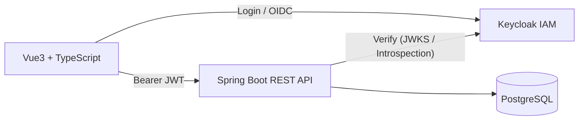
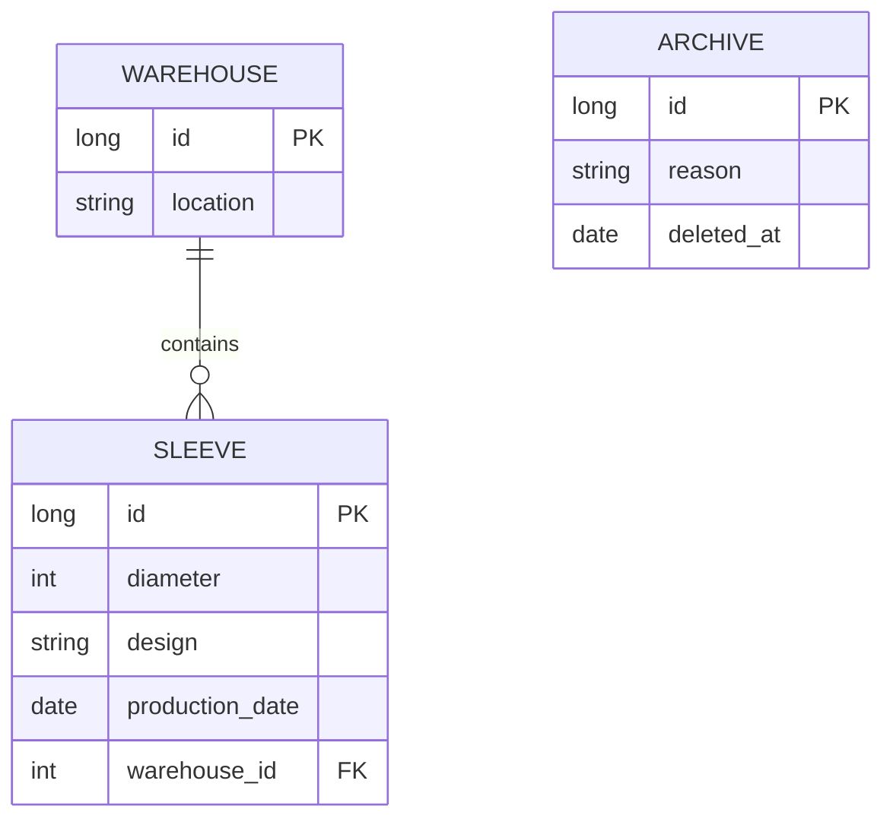

# Rüst Team Manager(RTM) Print Sleeve Management System
 — Digitizing sleeve management on the shopfloor

This is a web application I developed to digitize the management of printing sleeves in a factory.  
The old process was based on physical boards and handwritten labels, which caused frequent mistakes, wasted time, and no way to trace who did what.

Goal: Replace the manual process with a simple, reliable, on-prem system.

## Solution (after)

- Store all sleeves & print sets in a normalized database (PostgreSQL).
- Fast search by print set and sleeve attributes.
-Automatic, consistent A5 labels (no handwriting).
-Accountability: audit trail for cleaning & archiving; “who/when/what”.
-Access control: OAuth2/OIDC with Keycloak (JWT, RBAC).

On-prem deployment via Docker/Podman & Docker Compose.
---

## Features

- Sleeve database with details (ID, diameter, design, production date, warehouse location).
- Search by print set number → results in seconds instead of minutes.
- Automatic A5 label generation (no more manual Acrobat templates).
- Traceability: whoever prints the label is registered as the person who cleaned the sleeve.
- Admin functions: add/edit sleeves, archive with reason, view archive history.
- Archive view with statistics about retired sleeves.

---

## Tech Stack

- **Backend:** Java (Spring Boot)
- **Frontend:** Vue
- **Database:** PostgreSQL
- **Authentication:** Keycloak (roles for admin/user, OIDC)
- **Deployment:** Docker / Podman

---

## Architecture
**Frontend delivery (prod):** the SPA is built and bundled into Spring Boot’s `classpath:/static`, so the backend **serves both the API and the static UI**. There is **no separate frontend server**. In dev mode, the SPA runs on the Vite dev server (`http://localhost:3000`) and talks to the API.




- The frontend authenticates against Keycloak (OIDC) and obtains an access token.
- All application requests include a **Bearer JWT** to the Spring Boot API.
- The backend validates tokens (JWKS or token introspection).
- Services run in containers (Docker/Podman).

---

## Database (MVP)

The schema was kept intentionally simple for the initial version:

- **Sleeve** – main entity with attributes (ID, diameter, design, etc.)
- **Warehouse** – one-to-many relation with sleeves
- **Archive** – retired sleeves, stored separately for traceability

> **Note:** This ER diagram shows only the main entities and representative columns.  
> It is **not** the complete schema. (Full column list is intentionally omitted for readability.)



This schema can be extended later with logs, user actions, or audit trails if needed.

---

## Security

- Authentication and authorization via **Keycloak** (OIDC).
- Spring Boot acts as an OAuth2 **Resource Server**; JWTs are validated via the Keycloak issuer (**JWKS** / introspection).
- **RBAC**: Admin / User.
- **No sensitive personal data** is stored (only usernames for traceability).

---

## Getting Started

You can run the project in two modes. Choose one and follow the steps.

- **Prod/Compose mode** — everything runs via the **root** compose file (full app packaged).
- **Dev mode** — only infra (Keycloak + Postgres) from the **be/** compose; backend & frontend run locally.

Keycloak realms are imported **automatically on first start**, depending on which compose file you run.
Dummy data is also seeded on the first run.

```
keycloak/
  realm-prod/  # auto-imported by ./docker-compose.yml (Prod/Compose mode)
  realm-dev/   # auto-imported by be/docker-compose.yml (Dev mode)
```

> Env variables are already set in the compose files.
---
---

### Compose files

| Mode            | Compose file                   | What starts                         | Realm auto-import      |
|-----------------|--------------------------------|-------------------------------------|------------------------|
| Prod/Compose    | `./docker-compose.yml`         | Keycloak, Postgres, Backend and FE  | `keycloak/realm-prod/` |
| Dev local FE/BE | `be/docker-compose.yml`        | Keycloak, Postgres (infra only)     | `keycloak/realm-dev/`  |

---

### Ports (defaults)

| Service       | URL/Port              |
|---------------|-----------------------|
| App (FE, prod) | `http://localhost:8088` |
| Backend API    | `http://localhost:8081` |
| Keycloak       | `http://localhost:9090` |
| Frontend (dev) | `http://localhost:3000` |
| Postgres       | `localhost:5433`        |

> Adjust if your compose maps different ports.

---

### Option A — Prod / Compose Mode (root compose)

**1) Start services (from repo root)**
```bash
# Docker
docker compose up

# or Podman
podman compose up
```
Wait until Keycloak is ready and the realm import completes (first run may take ~15–30s).
**Note:** On the very first run, Docker/Podman will also build the backend image. Maven will download dependencies and package the app **inside the build container**, and the frontend will be **built and copied into `classpath:/static`**. This can take a few minutes; subsequent starts are much faster.

**2) Open App**
- App: http://localhost:8088
- Login.
  - Admin login: `username:0000` / `password:0000`
  - User login:  `username:0001` / `password:0000`
  - Try searching for Sleeve with Satz Nummer 1010 should bring up some data

**3)Keycloak UI**
- URL: `http://localhost:9090`
- Admin login: `username:admin` / `password:admin`

---
### Option B — Dev Mode (ruest-team-manager-be/ compose, local FE/BE)
**1) Start services**
- Navigate to ruest-team-manager-be/
```bash
# Using compose from there will bring up only Keycloak and PostgreSQL services.
docker compose up
# or
podman-compose up
```
Wait till Keycloak and PostgreSQL are up and runnning(Keycloak will auto-import the dev realm).

**2) Run Backend (locally)**
- Create a Spring Boot Run Configuration with profile dev (or set SPRING_PROFILES_ACTIVE=dev).
- Start the application (RustTeamManagerApplication).

**3) Run Frontend (locally)**
- Navigate to ruest-team-manager-fe/
```bash
cd ruest-team-manager-fe
npm install
npm run dev
```
**4) Open App**
- Frontend (dev): http://localhost:3000
- Admin login: `username:0000` / `password:0000`
- User login:  `username:0001` / `password:0000`
- Try searching for Sleeve with Satz Nummer 1010 should bring up some data
---

## Impact

- Reduced sleeve labeling errors from ~99% to nearly zero.
- Preparation time per print set shortened by several minutes.
- Introduced accountability and traceability for sleeve cleaning and archiving.

---

## Notes

- Designed for **on-premises** use in the factory network, not as an internet-facing application.

---

## License

MIT
