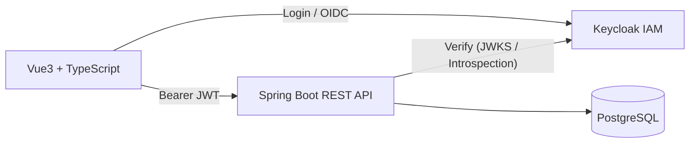

# Print Sleeve Management System

This is a web application I developed to digitize the management of printing sleeves in a factory.  
The old process was based on physical boards and handwritten labels, which caused frequent mistakes, wasted time, and no way to trace who did what.

The goal of this project was to provide a simple but reliable system that:
- stores all sleeves in a proper database,
- allows fast searching by print set,
- generates labels automatically and consistently,
- and adds accountability for cleaning and archiving.

**Stack:** Java (Spring Boot), Vue3 + TypeScript, PostgreSQL, Docker/Podman, Keycloak  
**Impact:** Fewer errors, faster preparation, clear traceability.

---

## Features

- Sleeve database with details (ID, diameter, design, production date, warehouse location).
- Search by print set number → results in seconds instead of minutes.
- Automatic A5 label generation (no more manual Acrobat templates).
- Traceability: whoever prints the label is registered as the person who cleaned the sleeve.
- Admin functions: add/edit sleeves, archive with reason, view archive history.
- Archive view with statistics about retired sleeves.

---

## Tech Stack

- **Backend:** Java, Spring Boot
- **Frontend:** Vue3 + TypeScript + Vuetify
- **Database:** PostgreSQL
- **Authentication:** Keycloak (roles for admin/user, OIDC)
- **Deployment:** Docker / Podman

---

## Architecture



- The frontend authenticates against Keycloak (OIDC) and obtains an access token.
- All application requests include a **Bearer JWT** to the Spring Boot API.
- The backend validates tokens (JWKS or token introspection).
- Services run in containers (Docker/Podman).

---

## Database (MVP)

The schema was kept intentionally simple for the initial version:

- **Sleeve** – main entity with attributes (ID, diameter, design, etc.)
- **Warehouse** – one-to-many relation with sleeves
- **Archive** – retired sleeves, stored separately for traceability

> **Note:** This ER diagram shows only the main entities and representative columns.  
> It is **not** the complete schema. (Full column list is intentionally omitted for readability.)


This schema can be extended later with logs, user actions, or audit trails if needed.

---

## Security

- Authentication and authorization via **Keycloak** (OIDC).
- Spring Boot acts as an OAuth2 **Resource Server**; JWTs are validated via the Keycloak issuer (**JWKS** / introspection).
- **RBAC**: Admin / User.
- **No sensitive personal data** is stored (only usernames for traceability).

---

## Deployment

**Requirements:**
- Docker or Podman
- JDK 21+
- PostgreSQL 13+

**Start all services:**
```bash
# Podman
podman-compose up

# or Docker
docker compose up
```

This starts the backend, database, and Keycloak in containers.

---

## Impact

- Reduced sleeve labeling errors from ~99% to nearly zero.
- Preparation time per print set shortened by several minutes.
- Introduced accountability and traceability for sleeve cleaning and archiving.

---

## Notes

- Designed for **on-premises** use in the factory network, not as an internet-facing application.

---

## License

MIT
